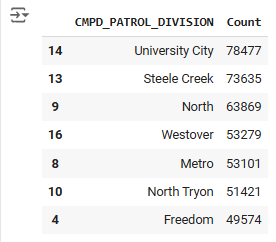

# Exploratory Data Analysis - Charlotte's Neighborhood Crime Over Time

#### Paula McCree-Bailey
### Overview
For this project, each participant will define their own unique problem and select a dataset to delve into.  The primary objective is to write about your process, communicate the rationale behind specific steps taken (such as preprocessing methodologies and their justifications), and weave a compelling narrative that encapsulates your data exploration journey, accompanied by insights gleaned through the visualizations you have created.

### Introduction
Crime is a concern for many urban areas in the United States, and Charlotte is no exception. It is important to understand crime patterns and statistics to help communities and law enforcement agencies develop plans, allocate resources, and engage with the community to improve public safety. The Charlotte-Mecklenburg Police Department (CMPD) regularly publishes detailed crime reports. As of July 22, 2024, overall crime in Charlotte has seen a slight increase of 1% compared to the previous year. This includes various types of crimes, categorized broadly into violent crimes and property crimes.
For this project, I plan to explore how crime has evolved over time in different communities and how does the location (such as open field, department store, hotel/motel, etc.) of the incident within neighborhoods effective crime? To answer this question, I will use the `CMPD_PATROL_DIVISION` and the `PLACE_DETAIL-DESCRIPTION` columns to examine these trends over time. By determining communities that are experiencing higher than normal levels of crime and specific location, the city, local law enforcement, and community can help allocated resources, develop plans and support community outreach to support all neighborhoods.

[CMPD's Incidents](https://data.charlottenc.gov/datasets/charlotte::cmpd-incidents-1/about)

### Dataset
The dataset is available from the city of Charlotte's open data portal. Data is available in various formats including CSV and contains both criminal and non-criminal incident reports from 2017 through 2024. It contains 688,973 observations and 29 features.

These features are 'X', 'Y', 'YEAR', 'INCIDENT_REPORT_ID', 'LOCATION', 'CITY', 'STATE', 'ZIP', 'X_COORD_PUBLIC', 'Y_COORD_PUBLIC', 'LATITUDE_PUBLIC', 'LONGITUDE_PUBLIC', 'DIVISION_ID', 'CMPD_PATROL_DIVISION', 'NPA', 'DATE_REPORTED', 'DATE_INCIDENT_BEGAN', 'DATE_INCIDENT_END', 'ADDRESS_DESCRIPTION', 'LOCATION_TYPE_DESCRIPTION', 'PLACE_TYPE_DESCRIPTION', 'PLACE_DETAIL_DESCRIPTION', 'CLEARANCE_STATUS', 'CLEARANCE_DETAIL_STATUS', 'CLEARANCE_DATE', 'HIGHEST_NIBRS_CODE', 'HIGHEST_NIBRS_DESCRIPTION', 'OBJECTID', and 'GlobalID'.

The website does not contain detailed metadata to describe. So, an attempt was made to define features based on the dataset. Below are descriptions of the less obvious features:
+	X, Y are unknown decimal values.
+ INCIDENT_REPORT_ID is the case number associated with the incident.
+	LOCATION is the physical address of the incident.
+	X_COORD_PUBLIC, Y_COORD_PUBLIC are unknown integer values.
+	CMPD_PATROL_DIVISION is the name of the division. It corresponds to numeric 'DIVISION_ID'.
+	ADDRESS_DESCRIPTION is a higher-level description of where the incident took place. Field mainly contained `Location of occurrence` or `Location where officer took report`.
+	NPA is the Neighborhood Profile Area ID, a unique number that is assigned to different neighborhoods in Charlotte. It replaced the previous method of using the name of the community.
+	PLACE_TYPE_DESCRIPTION is a detailed description of `LOCATION_TYPE_DESCRIPTION` which indicates private resident, Gas station, etc.
+	CLEARANCE_DETAIL_STATUS is detailed description of `CLEARANCE_STATUS` which provides how a case was cleared.
+	HIGHEST_NIBRS_CODE is the highest offense id number for the incident as defined by the FBI's National Incident-Based Reporting System (NIBRS)
+	OBJECTID is the index.
+	GlobalID is an unknown alpha-numeric value.
  
Mainly, I used `CMPD_PATROL_DIVISION` and the `PLACE_DETAIL-DESCRIPTION` columns for this project. The `CMPD_PATROL_DIVISION column `provides the names of the patrol division for a particular area of the city such as "North" and "Steele Creek" divisions. These divisions will represent the neighborhoods. The `PLACE_DETAIL-DESCRIPTION` provides the location where a crime took place. For example, "Private Resident", "Open Field", and "Air/Bus/Train Terminal". These columns will allow us to compare neighborhoods and look within neighborhoods to see if certain locations have experienced above average crime incidents.

### Pre-Processing
Pre-processing is one of the most important steps. By thoroughly cleaning the data, we will improve the accuracy of our model and save time by removing errors in advance. The pre-processing begins with importing the csv dataset. Initially, I received a “ParserError: Error tokenizing data. C error” which is caused when python process senses some rows have more data than expected. I added on_bad_lines ='skip' to the import statement which would skip any bad rows of data. After the import, shape of the data set was (688973, 29).

```
CLT_crime = pd.read_csv(r"C:\Users\SPT5555\Downloads\CMPD_Incidents.csv", on_bad_lines = 'skip')
pd.set_option('display.max_columns', None)
```
#### Irrelevant and Missing Values
`X` and `X_COORD_PUBLIC` contained the same value. The only difference was `X` was in decimal format and `X_COORD_PUBLIC`was in integer format. This was the same situation for `Y` and 'Y_COORD_PUBLIC'. Metadata could not be located on the website to determine the purpose of `X_COORD_PUBLIC` and `Y_COORD_PUBLIC`. All four features were removed, since they would not be used for analysis in this project. For this project, there is no use for `LATITUDE_PUBLIC` and `LONGITUDE_PUBLIC`. Both were removed from the analysis.

`INCIDENT_REPORT_ID` represents the unique report number associated with each incident. This ID does not offer beneficial information for the project.

`GlobalID'` is an alphanumeric variable. Its purpose could not be determined. So, I decided to remove the column.

`OBJECTID` seems to be an index for the dataset. I decided to remove this column and create an index after pre-processing the dataset.

Checked for missing values by using CLT_crime.info(). Six columns were missing values: STATE, ZIP, CMPD_PATROL-DIVISION, DATE_INCIDENT_END, ADDRESS_DESCRIPTION, and CLEARANCE DATE.  For these six columns the features were removed, or the data was imputed from other features.  LOCATION (physical address of the incident), CITY, STATE, and ZIP can be replaced by the DIVISION_ID OR CMPD_PATROL-DIVISION which are better suited in describing where the incident took place. Those four features were removed for this project. 

`ADDRESS_DESCRIPTION` can also be replaced by the DIVISION_ID OR CMPD_PATROL-DIVISION.  CMPD_PATROL_DIVISION is a more descriptive version of DIVISION_ID, so we can impute the missing information based on the current values in DIVISION_ID.  It was necessary to create a data dictionary of the divisions and use that information to fill in missing values.  It was also discovered there were other divisions such as SC.  Those rows were removed from the project.
```
# (portion of) dictionary for division
 division_mapping = {
   '11': 'North',
   '06': 'Eastway',
   '14': 'University City',
   '01': 'Central',
   ......
   '02': 'Metro',
   '92': 'Huntersville',
   '90': 'Davidson'
}

# fillna to address missing values in CMPD_PATROL_DIVISION
CLT_crime['CMPD_PATROL_DIVISION'] = CLT_crime['CMPD_PATROL_DIVISION'].fillna(CLT_crime['DIVISION_ID'].map(division_mapping))

# drop rows with Na in the CMPD_PATROL_DIVISION column
CLT_crime = CLT_crime.dropna(subset=['CMPD_PATROL_DIVISION'])
```
`DATE_INCIDENT_END` indicates the date that the incident or cases was resolved. I will impute those missing dates with today’s current date. This will provide an accurate measure of the number of days that a case has been open, if there is a decision to create a column in the future. For the same reason the `CLEARANCE DATE` and imputed it with the current date.
```
# impute replace values with current date
from datetime import datetime

current_date = datetime.now().date()

CLT_crime['CLEARANCE_DATE'].fillna(current_date, inplace=True)
CLT_crime['DATE_INCIDENT_END'].fillna(current_date, inplace=True)

```
`LOCATION_TYPE_DESCRIPTION` provides a high-level location for the incident. This will be replaced with a better feature.
Data Types Checked.

The data types were checked using CLT_crime.info(). All variables were of type object, except for YEAR, X_COORD_PUBLIC, Y_COORD_PUBLIC, LATITUDE_PUBLIC, LATITUDE_PUBLIC, and NPA. Those data types are fine.

Index
Lastly, the data set was indexed using CLT_crime.index = [x for x in range(1, len(CLT_crime.values)+1)] Normally, when data is imported, python automatically creates an index; however, the first row is index as 0 rather than 1. Now, the first row is indexed at 1 and the column is named ID.
```
CLT_crime.index = [x for x in range(1, len(CLT_crime.values)+1)]

# add index field name
CLT_crime.index.name = 'id'
CLT_crime.head(4)
```
The dataset contains datetime format. To create a "MONTH" column in order to visualize incidents per month, applied `.str.split` and tell python to extract the value in the 1 location which is the month.  Afterwards, we used a dictionary to replace the number with the name of the month.
```
CLT_crime['Month'] = CLT_crime['DATE_INCIDENT_BEGAN'].str.split("/", expand = True)[1]

dict_month = {"Month":{"01":"January", "02":"February", "03":"March", "04":"April",
                       "05":"May", "06":"June","07": "July", "08":"August", "09":"September",
                       "10":"October", "11":"November", "12":"December"}}
```

Finally, we have our final CMPD dataset.


### Visualizations

Our problem is to determine how crime has changed within neighborhoods (or divisions) in Mecklenburg County. Two tables were created using groupby and the CMPD_PATROL_DIVISION column to create a comparison of the number of incidents for the top 5 and bottom 5 neighborhoods. There are 16 divisions within the county.

University City has experienced 78,477 incidents since 2017. If we ignore the unknown, Davidson, Huntersville, and the airport in comparison, South Charlotte has the lowest crime incidents with 38,564.


A visualization was created with the annual data from University City. We can see a steady increase since 2017 with a drop off during the pandemic. Since 2020, crime has sharply increased. It will be interesting to see which locations in University are experiencing more crime. But before we look at locations, we will compare University City to other neighborhoods.  By identifing top 7 and bottom 7 neighborhoods based on crime incidents, it will be easier to make a comparison.  
```
# Seven neighborhoods with highest crime
Neigh_summary_Top = CLT_crime.groupby('CMPD_PATROL_DIVISION').size().reset_index(name='Count').nlargest(7, 'Count')
Neigh_summary_Top
```


```
# Seven Neighborhoods with lowest crime
Neigh_summary_Bot = CLT_crime.groupby('CMPD_PATROL_DIVISION').size().reset_index(name='Count').nsmallest(7, 'Count')
Neigh_summary_Bot
```


The chart below displays the top 5 neighborhoods that have been experiencing the most incidents since 2017. We can compare University City area with the other locations. We can visually see similar changes. There was a drop in 2020, likely to the pandemic and guidelines that strongly suggested that citizens stay at home. Beginning in 2021, we see a slow increase likely due to ease of restrictions.


This chart allows us to compare the top 5 and bottom 5 neighborhoods. We still see the drop in 2020 with a steady increase beginning in 2021.

All communities had a significant increase from 2022 to 2023 with the exception of the South division. It had an increase, but it was not as sharp. In general, crime has been increasing across the entire city.


### Types of Crimes for All Neighborhoods

We have determined all neighborhoods have been experiencing an increase in the number of incidents with the University City area experiencing the largest increase.

Now, let's look at what type of crime is committed most across all neighborhoods . From the table below it is "Theft from Motor Vehicle". Followed closely by "All other offense" and "Other Unlisted Non-Criminal" offenses.


### Target Neighborhood University City
From the data we have observed University City from 2017 to the present has had the highest number of criminal incidents.

Let's just look at 2023 in University City. We want to view the top ten criminal types and to see which month(s) had the highest number of incidents.


The bar chart still shows that Theft from Motor Vehicle is the top incident that occurred last year. Given the amount of news coverage on the TikTok challenge of stealing Kias, I am surprised that auto theft was not higher. It is number with less than 4,000 incidents.


Above we can see in the University City area, apartment/duplex have significantly more criminal incidents as compared to a private resident.  This could be due to the number of students attending UNC Charlotte and living in off-campus housing.

In 2023, most of the criminal incidents occurred in the months of August and September. The rise in crime during the summer is consistent with crime across the nation. There are various that attribute the "rise in temperatures causes a rise in tempers, kids and college students are out of school, and everyone wants to be outside.


### Conclusion / Impact
For our analysis we were able to see that the University City area in Mecklenburg has had the highest overall incidents of crime since 2017. Theft from motor vehicles was the number one type of crime committed in the county including within University City. Although, in other neighborhoods crime was nearly equally likely to be committed in either a private resident or apartment/duplex, in University City a crime was significantly more likely to happen if you lived in an apartment/duplex.

When technology is used in crime prevention, it can be both positive and negative. The positive impact is that law enforcement could meet with city officials to discuss ways to reduce crime by increasing lighting in areas, increased police patrols in certain or talking with community groups who are able to go into the neighborhoods (along with law enforcement) to make a positive impact.

On the negative side, law enforcement could decide to increase patrols in certain areas to the point that everyone in the community feels as if they were under surveillance. It's possible that crime could be reduced, because the crimes are leaving one area and moving to another area. Also, we need to understand that AI is making predictions on past events. People can change but AI does not consider that fact.

The data missing could provide more details about types of crime committed. For example, "All other offenses" is one of the largest categories, but we don't know which offenses are in that category.

The data is also missing info about the suspect. I am curious about the age of the suspect, level of education, number of past offenses and whether they lived in the division the crime was committed in. I wonder if crime is just a crime of opportunity, and you know you can get away or if it's planned out from the beginning.


### References:
https://www.charlottenc.gov/cmpd/News-Information/Crime-Statistics-Report
https://data.charlottenc.gov/datasets/charlotte::cmpd-incidents-1/about
https://ui.charlotte.edu/story/how-find-information-your-neighborhood
https://www.charlottenc.gov/cmpd/ePolicing-Resources/Patrol-Area-Divisions
https://www.wired.com/story/crime-prediction-racist-history/
https://www.pbs.org/newshour/nation/why-shootings-and-violence-increase-in-the-summer-months
